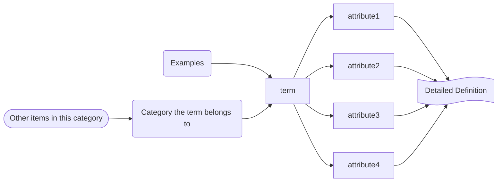

# Teaching for Deeper Learning

**Strategies suggested in the book**

McTighe, J., & Silver, H. F. (2020). Teaching for deeper learning: Tools to engage students in meaning making. ASCD.

Antoine-Pierre Mongin, Chene (Oak Tree), 1816, NGA 57501.jpg 
https://purl.org/nga/collection/artobject/57501, CC0, via Wikimedia Commons

---
layout: image-right
class: rotate-20 mt-40
image: /2_2.png
backgroundSize: contain
---

# Framing Curriculum and Instruction around Important Ideas

---
layout: image-left
image: /3.jpg
backgroundSize: 100% 110%
---

# A Study In...

**Planning to focus on key concepts – NOT topics, skills or texts**

- There is no "correct" choice for concept or theme focus

**The study should**
- Support target standards
- Support "big" ideas

---

# Concept Word Wall

**Post focus themes, concepts, and processes on a wall or bulletin board**

- Unit specific words
- Whole discipline words
- Concepts that relate across disciplines

**These key words serve as reminders to the teacher as well as the students.**

---

# Essential Questions

**Open-ended questions that reflect the big ideas that students should understand**

- Serve to "awaken" not "train"
- Abstract and Transferable concepts and processes
- Explored over time
- Responses become more sophisticated
- Big idea → Essential Questions

---
layout: image-right
image: /6.png
backgroundSize: contain
class: mt-40
---

# Conceptualizing

"The Human Digestive System" Chavan R L ; Khandagale V S, 
CC BY-SA 4.0, via Wikimedia Commons

---

<Arrow x1="100" y1="100" x2="800" y2="100" width="8" />

  
## The What

- Leads to deep learning
- Using facts, examples, observations, and experiences to construct undersatandings of important concepts and conceptual relationships.
  

  
## The Why

- Stimulates meaning making and leads to deep learning.
- Students can unite ideas under a larger conceptual umbrella
- Prepares students to develop important understandings on their own.

---
class: mt-40
---

<Arrow x1="800" y1="20" x2="250" y2="200" width="10"/>

# The How

- Concepts and generalizations from observations and examples
- Uncover conceptual definitions and understandings
- Make relevant thinking processes more accessible through lesson structure and scaffolding

---

# Concept Attainment

**Inductive avenue for students to develop their own concept definitions**

1. Identify Concept (named either at the beginning OR the end)
2. Develop Yes/No examples
3. Present examples: Students identify what Yes examples have in common AND what the No examples do not share with them
4. Present additional examples: Students test and redefine list of attributes
5. Review examples with students - develop an accurate final list of concept attributes

---
layout: two-cols
---

# Yes: 

Examples of the Concept

::right::

# No: 

Nonexamples

---

# Concept Definition Map

**Helps students understand and gather information necessary to arrive at a concept definition**

- Organizes important information visually
- Guides students to collect information about important aspects
- Includes connections to other ideas

---

# Concept Definition Map

---
layout: image-left
image: /13.jpg
---

# A Study In

Da Vinci's Study of the Graduations of Shadows on Spheres

- Ask students to identify a broader concept or theme that can tie learned information together.
- Have students justify choices with facts and examples
- Be sure to include "Because..."

---
class: mt-50
---

# I see _(topic)_ as a study in _(concept)_ because... ____

---
class: mt-40
---

# Adding Up the Facts

**Scaffolds facts leading students to larger concepts, connections and relationships forming big ideas.**

- Identify concept
- Generate factual statements that will lead students to understand umbrella concepts
- Provide students with the generated facts
- Ask them what they can conclude by adding up the provided facts

---

# Adding Up The Facts

  <ul>
    <li style="padding-top: 1em">Fact A:</li>
    <li style="padding-top: 2em">Fact B:</li> 
    <li style="padding-top: 2em">Fact C:</li> 
    <li style="padding-top: 2em">Fact D:</li> 
  </ul>

**Conclusion:**

---

# Big T Organizer

**A Good Night's sleep is essential to good health**

- Our bodies heal while we sleep
- Sleep gives us energy to get through each day
- Children need lots of sleep so their bones and muscles can grow.
- Dreams help our brains sort through our memories and thoughts

---
class: mt-40
---
# Connect the Concepts

**Helps students understand the relationships between and among concepts**

- Ask students to think about the relationship between two or more concepts
- Provide learning experiences and materials that illustrate and allow students to discover the nature of relationships
- Ask students to connect the concepts in a sentence that describes the relationship
- Have students support or further explain relationships using facts and examples from the learning experiences
- Provide opportunities to reexamine and test relationships with new examples and contexts

---
layout: image-left
image: /19.jpg
---

# Note Making and Summarizing

Rostov on Don's Lecture notes on mathematical and linear algebra

---
layout: image-right
image: /20.png
---

# Tools for...

- Compiling large amounts of information
- Dealing with informational complexity
- Synthesizing information into a meaningful whole

Franz van Duns, CC BY-SA 4.0, via Wikimedia Commons

---

# Window Notes

**Teaches students the difference between copying notes and making notes.**

**Students utilize an organizer that helps them collect four sets of notes:**

1. Facts: What are the important facts and details
2. Questions: What questions come to mind? What am I curious about?
3. Connections: How does this relate to my experiences or to other things I have learned?
4. Feelings and Reactions: How do I feel about what I am learning?

---

# Facts

# Feelings and Reactions

# Questions

# Connections

---

# Math Notes

**Similar to Windows: Used to solve challenging word problems**

1. Identify the facts of the problem, Id missing information
2. Clarify the Question, "Id hidden questions"
3. Create a visual diagram
4. Think through the steps to solve

---

# Math Notes Organizer

The Facts

The Steps

The Solution

The Question

The Diagram

---

# Interactive Note Making

**Based on SQ3R**
**(Survey, Question, Read, Recite, and Review)**

**Trains students to pull important information from a text.**

1. Actively preview section
2. Convert each section or subheading into a question
3. Review questions as they read
4. Check understanding: fold notes over and answer questions
5. Check responses to notes

✔ = I know this
★ = I need to review this
? = I have a question about this

---

# Interactive Note Making

| Questions | Main Ideas | Supporting Details | Monitor |
|-----------|------------|-------------------|---------|
| | | | ✔ ★ ? |
| | | | ✔ ★ ? |
| | | | ✔ ★ ? |
| | | | ✔ ★ ? |
| | | | ✔ ★ ? |
| | | | ✔ ★ ? |

✔ = I know this
★ = I need to review this
? = I have a question about this

---
layout: image-right
image: /27.jpg
class: mt-40
---

# Webbing

Don Horne, CC BY 4.0, via Wikimedia Commons

---
layout: image
image: /chart2.png
backgroundSize: contain
---

style="width: 0; height: 0; border-left: 200px solid transparent; border-right: 200px solid transparent; border-bottom: 300px solid blue;"
---

# 421 Summarize

**Teaches students how to separate essential from non-essential information**

1. Students review text or lesson, picking 4 very important ideas or points
2. Students pair up to share and compare ideas, reaching consensus on two most important ideas
3. Student pairs join another pair and share, compare and pick the ONE most important idea

---
layout: center
---

# 421 Summarize

**FOUR key ideas** 

**The TWO most important ideas**

**The ONE most important idea**

**Summary Paragraph: What did I learn?**

---

# AWSOME Summaries

- **A:** Is the information in my summary **accurate**?
- **W:** Has the length of the original material been **whittled down** significantly?
- **E:** Did I include **enough** information to capture the essence of the original material?
- **S:** Is the information in my **summary** logically organized and sequenced?
- **O:** did I give an **objective** summary of the original material?
- **M:** Did I summarize the original material in **my own words**?
- **E:** Does my summary contain the **essential** ideas only?

---
layout: image-left
image: /32.png
class: mt-40
---

# Comparing

NASA and ESA, CC BY-SA 4.0, via Wikimedia Commons

---

# Compare and Conclude Matrix

 Criteria

Items to be compared

**Conclusion:**

---

# Comparison Matrix

Dimensions for Comparison

Unique Characteristics

Similar to Both

Unique Characteristics

---
layout: image-left
image: /35.png
class: center
---

# Top Hat Organizer

 **Differences**

Unique to ________

Unique to ________

 **Similarities**

Everaldo Coelho (YellowIcon);, LGPL, via Wikimedia Commons

---
layout: image-left
image: /36.jpg
---

# Reading for Understanding

Louvre Museum, Public domain, via Wikimedia Commons

---

# Four Reading Stances

| Stances | Fiction | Nonfiction |
|---------|---------|------------|
| **Literal** | • What is this text about? • Where is the setting • When did this piece take place • Who are the major and minor characters? • What is the situation or problem? • What are the most important events? | • What is the topic or the gist of this text? • What are the key facts? • What is the most important information conveyed? • What did you learn from this? |
| **Interpretive** | • What is the meaning of ____? • What is the implicit theme or message? • What is the significance of [the title, an event, a quote, etc.]? • How would you describe the tone or mood? • What traits do the characters exhibit? | • What is the meaning of ____? • What conclusions can you draw from this text? • What is the [attitude, philosophy, political position, etc.] of the author? • How does this piece compare to [one or more related works]? |

| Stances | Fiction | Nonfiction |
|---------|---------|------------|
| **Personal** | • How is this like something from your life? • How do you relate to this theme? • What did this make you think or feel? • What would you have done if you were the main character? • What questions would you like to ask the author/character(s)? | • What did this make you think? • Do you agree with the author? • Are you convinced? Persuaded? • How did it influence your thinking? • What additional information is needed? • What questions would you like to ask the author? |
| **Critical** | • What are the greatest strengths of this piece? The greatest weaknesses? • Imagine you are a literary critic: How effectively did the author convey the theme? Describe the setting? Develop characters? • How effectively did the author use [flashbacks, irony, symbolism, etc]? • Would you recommend this to others? | • What are the greatest strengths of this piece? The greatest weaknesses? • How clear was this piece? How accurate? How complete? How unbiased? • How well does the organizational structure work? • How effectively did the author achieve his or her purpose? |

---

# Reading for Meaning Organizer

Evidence That Supports

Statements

Evidence That Refutes

---
layout: image-left
image: /40.jpg
---

 

# Visualizing And Graphic Representation

National Archives and Records Administration, Public domain, via Wikimedia Commons

---

# Advance Organizer

A visual hierarchical structure showing main topic branching into three major subtopics.

---

# Mind's Eye Organizer

Key Words:

Name of Text:

Author: 

Picture:

Feelings or Personal Connections: 

Questions:

Predictions:

---
layout: two-cols
---

# Perspective Chart

A visual showing a **Topic or Issue** in the center with four different perspectives radiating outward.

::right::

  <!-- Inner frame -->
  

  <!-- Diagonal lines -->
  

    

  

  

    

  

  <!-- Center box -->
  

    Topic or Issue:
  

---

# Split Screen Notes

Sketch

Big Ideas and Important Details

# 1

# 2

# 3

---

# Story Map

Who are the main CHARACTERS? Briefly describe them.

What is the SETTING? Describe where and when the story takes place..

 What is the problem or CONFLICT? 

 What is the sequence of EVENTS? (First, next, then...) 

How does the problem or conflict get resolved? (RESOLUTION)

---

# Visualizing Vocabulary

Term

Textbook Definition

My Definition

Image/Symbol/Icon 

Explanation 

---
layout: fact
class: text-center
---

# Putting It All Together

---

# Planning Framework

Process

Content

How will I frame the content around big ideas? 

How will I ensure that students actively make meaning of content?

Unit Topics

A Study in...

Essential Questions

Skills

Tools
CON; NMS; COM; RU; PH; VGR; PTE

*Key to thinking skills: Conceptualizing; Note Making and Summarizing; Comparing; Reading for Understanding: Predicting and Hypothesizing; Visualizing and Graphic Representations: Perspective Taking and Empathizing.

---

# Five Episode Framework

Instructional Episodes

 <i>Topic</i>: A study in <i>Concept</i> 

1. Preparing students for new learning

2. Presenting new learning

3. Deepening and reinforcing learning

4. Applying and demonstrating learning 

5. Reflecting on and celebrating learning

---
class: text-center
layout: end
---

# -fini-

---
end
---
